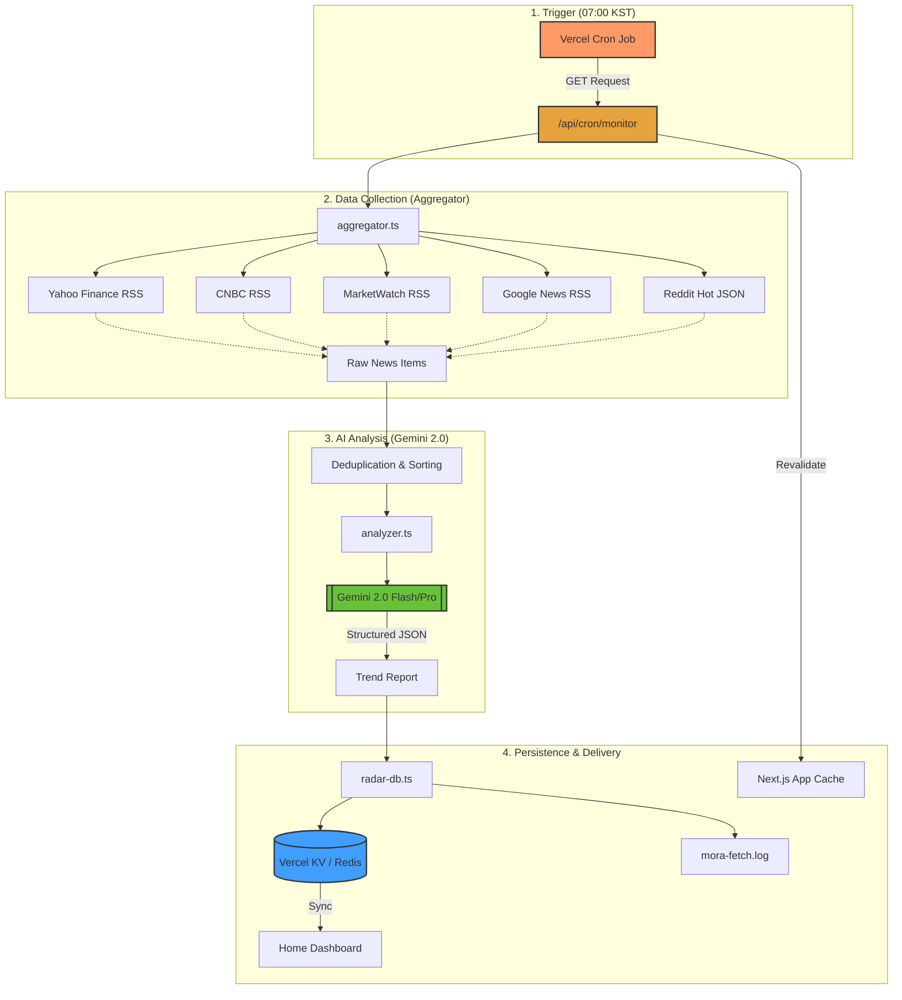

# Mora (Morning Radar) 📡

> **글로벌 금융 시장의 파도를 실시간으로 포착하는 프리미엄 AI 리포트 서비스**

Mora는 매일 아침 수백 개의 글로벌 금융 뉴스, 커뮤니티 트렌드, 경제 데이터를 자동으로 수집하고 AI를 통해 분석하여 투자의 통찰력을 제공하는 **지능형 시장 모니터링 플랫폼**입니다.

## 🌟 Key Features

### 1. 전방위적 데이터 수집 (5x News Aggregator)
- **Multi-Source**: Yahoo Finance, CNBC, MarketWatch, Google News 등 검증된 메이저 미디어는 물론, Reddit과 같은 대규모 커뮤니티의 실시간 심리(Sentiment)를 함께 수집합니다.
- **Deduplication & Sorting**: 수백 개의 피드에서 중복된 뉴스를 제거하고, 가장 최신(Recency) 순서로 정렬하여 분석의 시의성을 보장합니다.

### 2. AI 기반 심층 분석 (AI Insight Engine)
- **Gemini 2.0 Powered**: Google Gemini 2.0 모델을 사용하여 방대한 데이터를 요약하고, 핵심 트렌드를 도출합니다.
- **Short-term vs Long-term**: 실시간 이슈와 구조적 변화를 구분하여 투심(Sentiment), 수혜주(Beneficiaries), 영향도(Severity)를 입체적으로 분석합니다.
- **Transparency**: 분석의 근거가 되는 원본 기사 URL을 트렌드별로 최소 10개 이상 제공하여 정보의 투명성을 극대화했습니다.

### 3. 프리미엄 사용자 경험 (Premium UX/UI)
- **Modern Aesthetic**: Glassmorphism, Subtle Gradients, Hardware-accelerated Animations를 적용하여 현대적이고 세련된 인터페이스를 제공합니다.
- **Real-time Feedback**: `sonner` 라이브러리를 통해 데이터 업데이트 및 분석 과정을 고급스러운 토스트 메시지로 안내합니다.

### 4. 자동화된 파이프라인 (Automated Pipeline)
- **Vercel Cron Jobs**: 매일 아침 7시(KST)에 자동으로 최신 데이터를 수집하고 리포트를 갱신합니다.
- **Smart Revalidation**: 데이터가 업데이트되면 Next.js의 캐시를 즉시 재검증하여 사용자에게 항상 최신 정보를 노출합니다.

## 🛠 Tech Stack

- **Framework**: [Next.js 15 (App Router)](https://nextjs.org/)
- **UI & Styling**: [Tailwind CSS 4](https://tailwindcss.com/), [shadcn/ui](https://ui.shadcn.com/)
- **AI Backend**: [AI SDK (Vercel)](https://sdk.vercel.ai/), [Google Gemini Pro](https://deepmind.google/technologies/gemini/)
- **Data Gathering**: [RSS Parser](https://www.npmjs.com/package/rss-parser)
- **State & Feedback**: [Sonner](https://sonner.stevenly.me/)
- **Storage**: [Local Filesystem Database (JSON)](/src/lib/radar-db.ts) (Production: Persistent Database support included)

## 📡 Pipeline Architecture

매일 아침 7시(KST), Mora의 데이터 엔진이 어떻게 전 세계의 금융 정보를 수집하고 분석하여 사용자에게 전달하는지 보여주는 상세 아키텍처입니다.

### 1. 파이프라인 흐름도 (Mermaid Diagram)

### 2. 단계별 상세 동작 원리

#### 계층 1: 실행 (Trigger)
- **Vercel Cron Job**: `vercel.json`에 정의된 스케줄(`0 22 * * *` UTC / 07:00 KST)에 따라 API 엔드포인트를 호출합니다.
- **Security Check**: `CRON_SECRET` 서버측 환경 변수를 검증하여 권한이 없는 외부 접근을 차단합니다.

#### 계층 2: 수집 (Data Collection)
- **Multi-Threading**: 모든 데이터 소스(Yahoo, CNBC, Reddit 등)에 대해 병렬 비동기 요청을 수행하여 전체 수집 시간을 최소화합니다.
- **Source Transparency**: 각 페처(Fetcher)는 뉴스 제목뿐만 아니라 **원본 URL**을 함께 수집하여 리포트의 신뢰도를 높입니다.

#### 계층 3: 분석 (AI Processing)
- **Deduplication**: 여러 매체에서 보도된 동일 뉴스를 링크 기반으로 제거하여 분석 노이즈를 줄입니다.
- **Recency First**: 수집된 수백 개의 기사를 최신순으로 정렬하여, AI가 가장 최근 발생한 이벤트를 중심으로 분석하도록 유도합니다.
- **Context Handling**: 약 15만 자의 풍부한 텍스트 데이터를 Gemini 모델에 전달하여 시장의 맥락(Context)을 완벽하게 파악합니다.

#### 계층 4: 저장 및 서빙 (Persistence & Delivery)
- **Vercel KV (Redis)**: 분석된 리포트를 전 세계 어디서든 즉시 접근 가능한 클라우드 데이터베이스에 실시간 동기화합니다.
- **Cache Purge**: `revalidateTag`를 통해 Next.js 서버의 기존 캐시를 강제로 비우고, 사용자가 페이지를 새로고침할 때 즉시 최신 리포트가 보이도록 합니다.
- **Logging**: 수집된 모든 URL 경로와 성공 로그를 상세히 기록(`mora-fetch.log`)하여 관리자가 모니터링할 수 있도록 합니다.

---

이 아키텍처는 데이터의 **신선도(Recency)**, **투명성(Transparency)**, 그리고 **안성성(Persistence)**을 목표로 설계되었습니다.

## 📝 License

Copyright © 2026 Mora. All rights reserved.
